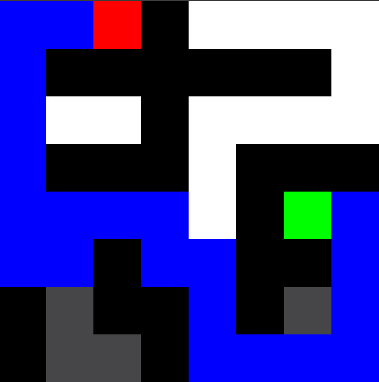

# Maze Solver

Maze Solver was written in C++ and uses SDL2 for the maze rendering. The aim of this project is to explore path-planning/searching algorithms which have many applications such as mobile robotics and network routing. Currently the only implemented algorithm is Dijkstra's path planning algorithm. 
The file structure allows for easy addition of new solving algorithms just by adding the header to the `include/solvers` directory and the source code to the `src/solvers` directory. The currently implemented Dijkstra solver can be used as a template.

Unsolved                   | Dijkstra
:-------------------------:|:-------------------------:
  |  

A simple maze builder has also been implemented and has been used to create some of the larger maps in the `maps` folder.
To use the maze builder you can simply click and drag across the screen to build the blocks. To change block types simply click on the same block to change the block type. When everything is done simply press space to save the map. View the instructions below for build/run instructions.


## Build Instructions
### Dependencies
- **SDL2** (video/audio/controls)
  - _Linux_: `apt install libsdl2-dev` (on Ubuntu)
  - _MacOS_: `brew install SDL2`
  - _Windows_:
    - Download dev libs from [here](https://www.libsdl.org/download-2.0.php) and
      unzip them somewhere.
    - EITHER: Set the `SDL` environment variable to point to the dev libs
    - OR: Unzip them to `C:\sdl2\` default location
    - OR: Modify the `SDL2_MORE_INCLUDE_DIR` variable in `CMakeLists.txt` to
      point to the SDL2 dev libs

### Compiling
__Note: Only tested in Ubuntu 18.04__
```sh
mkdir build
cd build
cmake ..
make
```

TODO: add Windows build instructions

## Running
The repo consists of 2 programs
### MazeSolver
MAZESOLVER will load in an existing map and attempt to solve it. To run it simply type:
```sh
./MAZESOLVER {$filename}
```
where `{$filename}` contains the path to your maze.

### MazeBuilder
MAZEBUILDER will allow you to create your own mazes. To run it simply type:
```sh
./MAZEBUILDER {$filename} {$x} {$y}
```
where `{$x}` and `{$y}` are the number of rows and columns you want your maze to be.

__NOTE: Only row and column values divisible by 640 can be used__